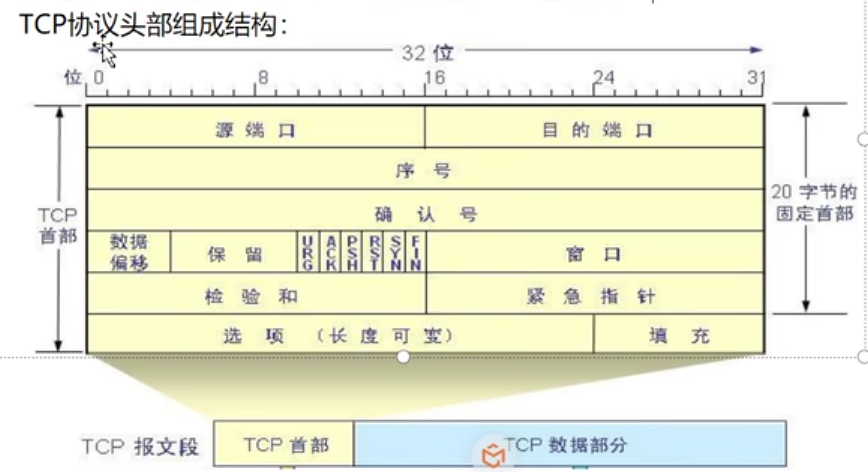
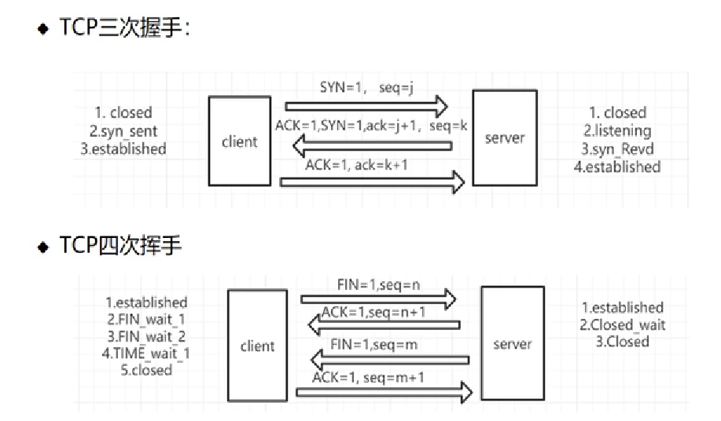
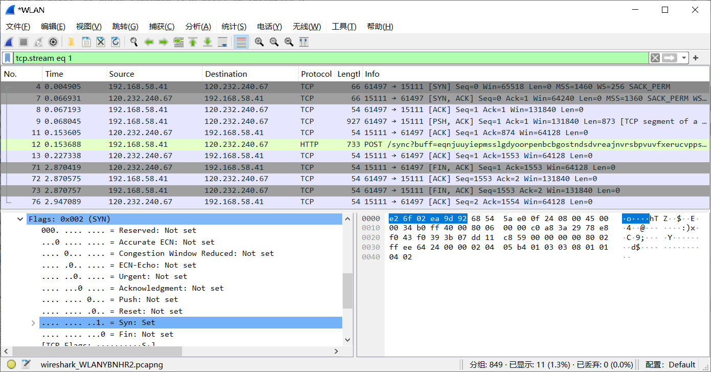

# TCP 协议概述

## 一、TCP协议的概念

TCP 传输控制协议，顾名思义就是要对数据的传输进行一定的控制

头部信息组成如下：

## 二、TCP的连接过程与断开连接

seq（序号）：目的是由于数据包可能过大，需要进行分段  注意这里后续需要重组（需要按顺序重组）

ACK（确认标志）：为1表示接受到了这个请求

ack（确认号）：回应要带序号 ack== seq + 1 表明服务器希望收到下一个序号的包

code control flag（状态控制码）：标志位

RST(重置) ：表示连接释放 TCP连接出现错误，比如服务器崩溃，断开连接

SYN（同步）：1 表示是一个发起连接的消息以及确认接受连接的消息 

FIN（终止）：1 表示发送报文结束，释放链接，与RST不一样，这个是正常结束

### 1.TCP的三次握手

（客户端）第一次握手：SYN = 1，seq = j

（服务器）第二次握手：ack= j + 1，ACK = 1，SYN = 1，seq（这个包自己的序号）= k

（客户端）第三次握手：ACK = 1，ack = k + 1

### 2.TCP的四次挥手

（客户端）第一次挥手：FIN = 1，seq = n

（服务器）第二次挥手：ACK = 1，ack = n + 1

（服务器）第三次挥手：FIN = 1，seq = m

（客户端）第四次挥手：ACK = 1，FIN = 1，ack = m + 1

### 3.TCP的网络抓包

图中的抓包TCP的整体过程全部被包括

其中三次握手之后进入了HTTP协议
