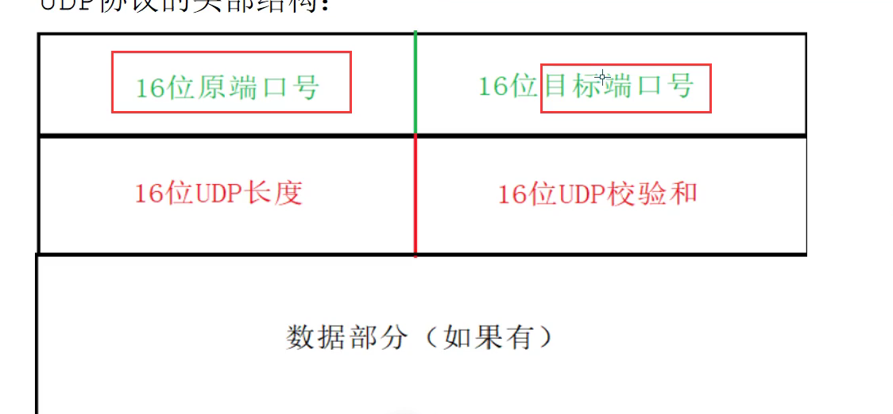
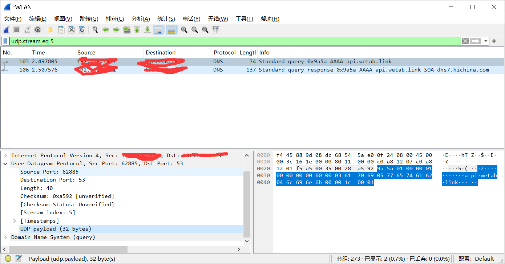
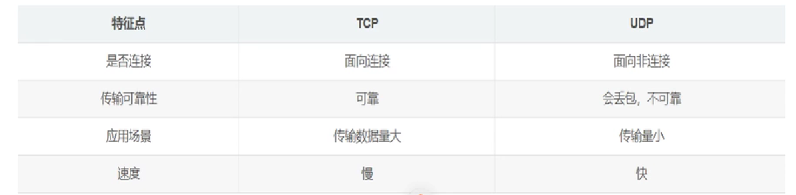
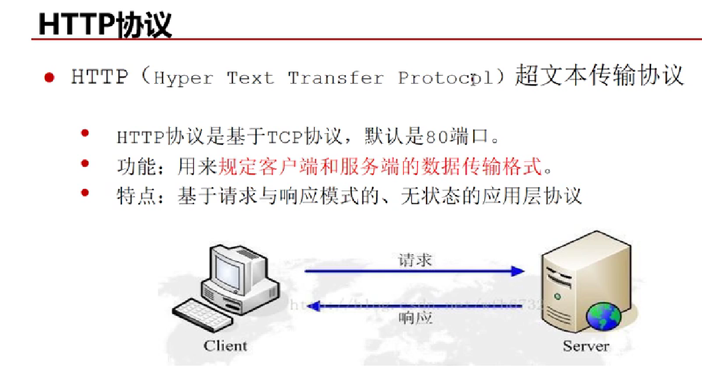
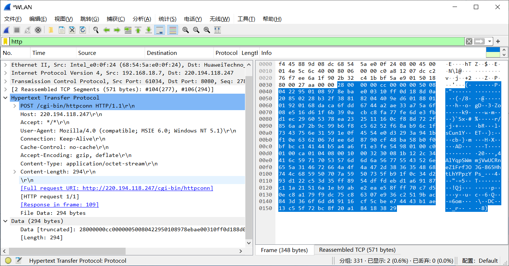
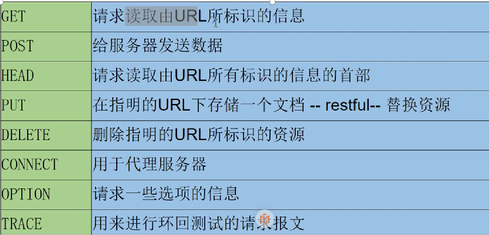
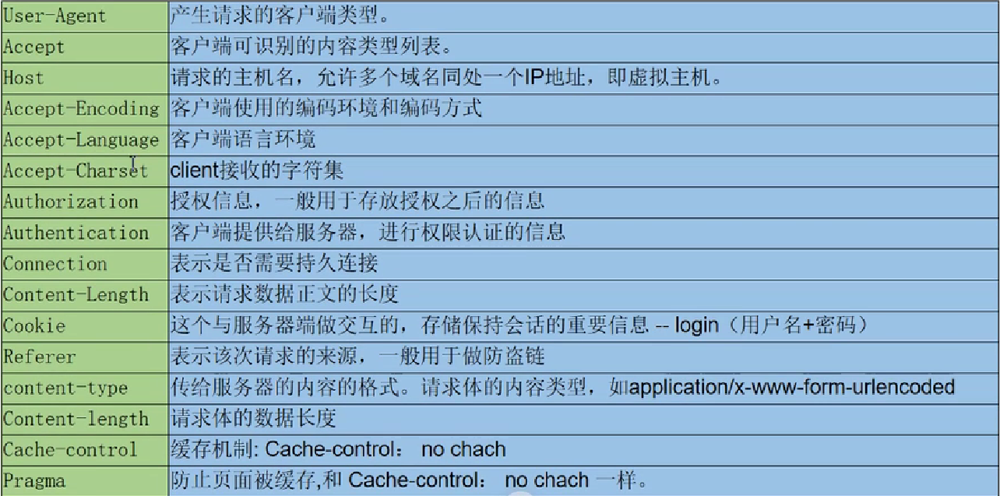
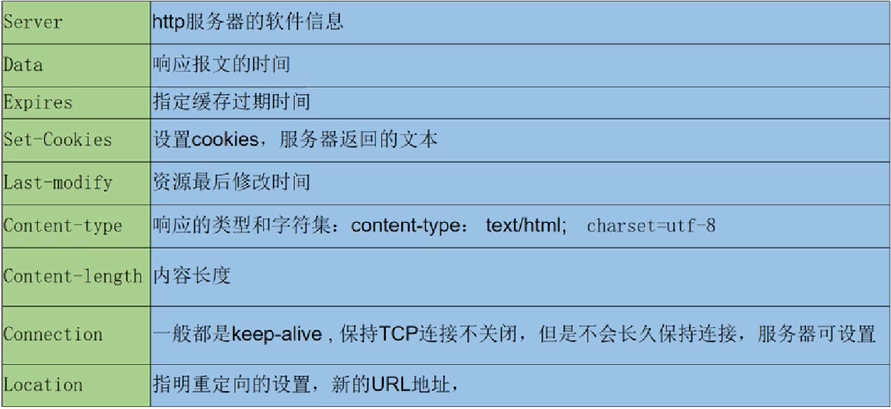

# TCP 协议概述

## 一、TCP协议的概念

TCP 传输控制协议，顾名思义就是要对数据的传输进行一定的控制

头部信息组成如下：

协议：HTTP、HTTPS、FTP

## 二、TCP的连接过程与断开连接

seq（序号）：目的是由于数据包可能过大，需要进行分段  注意这里后续需要重组（需要按顺序重组）

ACK（确认标志）：为1表示接受到了这个请求

ack（确认号）：回应要带序号 ack== seq + 1 表明服务器希望收到下一个序号的包

code control flag（状态控制码）：标志位

RST(重置) ：表示连接释放 TCP连接出现错误，比如服务器崩溃，断开连接

SYN（同步）：1 表示是一个发起连接的消息以及确认接受连接的消息

FIN（终止）：1 表示发送报文结束，释放链接，与RST不一样，这个是正常结束

### 1.TCP的三次握手

（客户端）第一次握手：SYN = 1，seq = j

（服务器）第二次握手：ack= j + 1，ACK = 1，SYN = 1，seq（这个包自己的序号）= k

（客户端）第三次握手：ACK = 1，ack = k + 1

### 2.TCP的四次挥手

（客户端）第一次挥手：FIN = 1，seq = n

（服务器）第二次挥手：ACK = 1，ack = n + 1

（服务器）第三次挥手：FIN = 1，seq = m

（客户端）第四次挥手：ACK = 1，FIN = 1，ack = m + 1

### 3.TCP的网络抓包

图中的抓包TCP的整体过程全部被包括

其中三次握手之后进入了HTTP协议

# UDP协议 用户数据报协议

## 一、UDP协议概述

其头部信息如下：

与TCP不同，没有序号、确认号、标志位等

所以UDP不会建立链接，也是无连接的传输协议，是不可靠协议，可能会丢包

使用场景:

1.不需要可靠机制，只要求速度快

2.流媒体，游戏，IP电话

3.资源小的场景

优点：速度快

协议：DNS（域名解析协议）、SNMP（简单网络管理协议）、DHCP（动态主机获取IP的协议）、RIP（简单路由协议）

## 二、抓包解析UDP

# TCP和UDP协议区别

# HTTP协议 (应用层协议：为了规范各种应用的数据格式)

## 一、HTTP协议概述

## 二、抓包解析HTTP（无状态、无连接）

### 1.解析

共包括四个部分：

一、请求行：（方法）+（URL：用于统一资源定位）+（协议版本）

包含这些标识：

二、请求头部信息

注意点：

User-Agent里面会有浏览器内核和windows信息，如果不带上可能会被识别成爬虫程序从而没有回复

Cookie比较重要，是实现HTTP无状态的重要举措

GET请求一般没有请求体

三、响应报文:响应行 + 响应头 + 空行 + 响应正文

1.响应行(HTTP版本信息 + 状态码 + 原因回复)

常见状态码：

1xx ---接受请求正在被处理

2xx ---请求正常处理完毕

3xx ---302(重定向)，304（缓存----没有改动，服务器不处理）

4xx ---客户端问题导致的错误，比如网址错误---404

5xx ---服务器问题导致的错误，比如---503服务有问题

2. 响应头部

注意点：

Set-Cookies

Connection:保证无连接

四、响应正文：返回的信息

## 三、HTTP的无连接

### 1.表现

从两方面进行限制

一、限制每次连接只处理一个请求

二、服务器处理完客户端的请求后，等待客户端的应答，断开连接

由来：用户量比较大，单个用户间歇性大，数据没有关联性，一直保持会造成资源浪费

问题：网页越来越复杂，由于TCP连接断开，会有很多的图片信息（需要数据比较多，TCP传输需分段）每次都要TCP连接，所以效率会很低  所以在头部中Connection中的keep-alive（长连接，保证TCP连接会被持有一定的时间）会解决这个问题

但Keep-alive的时间太久会导致上述“由来”中的问题出现，所以我们要根据我们的需求要设置keep-alive保持的时间
