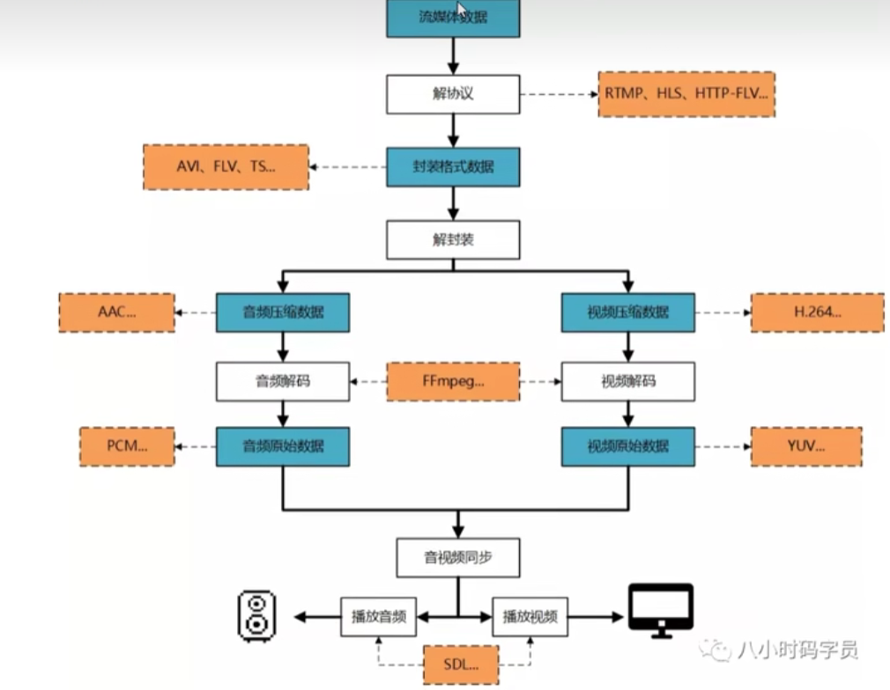
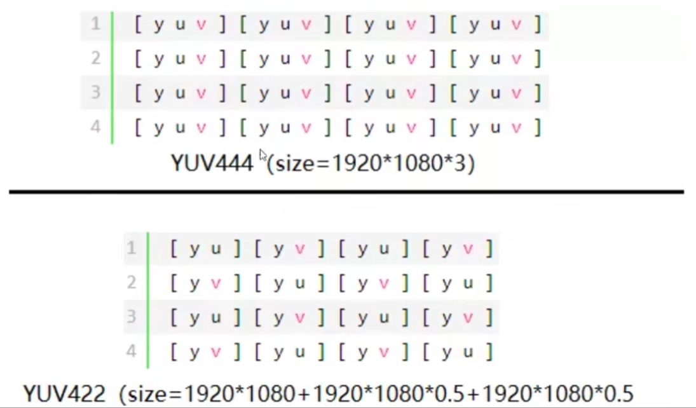
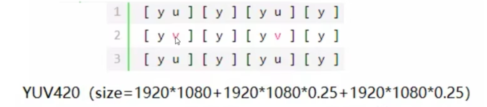
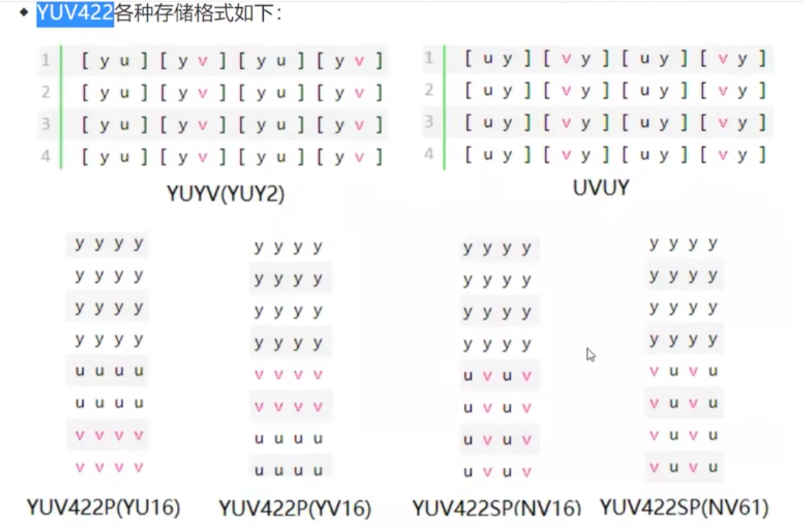
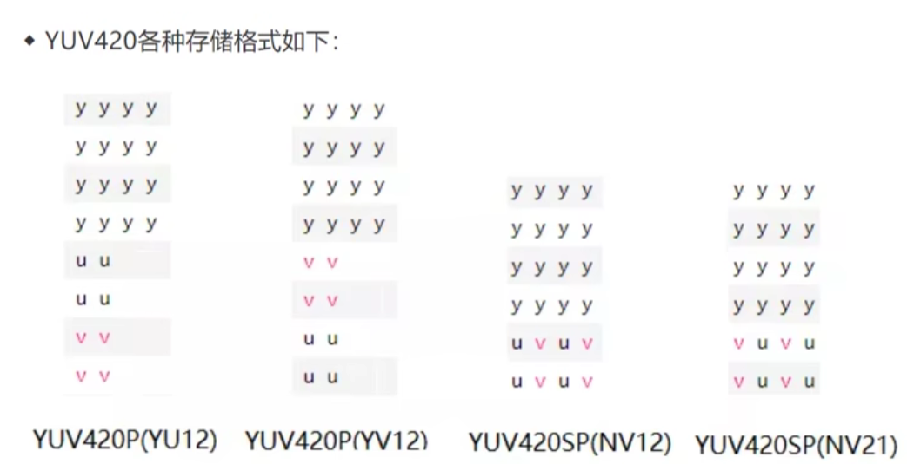
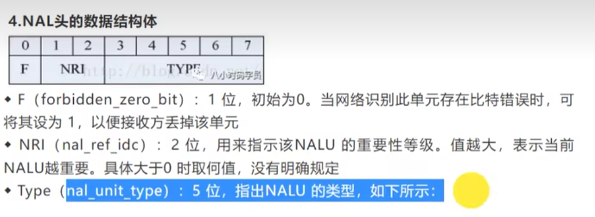
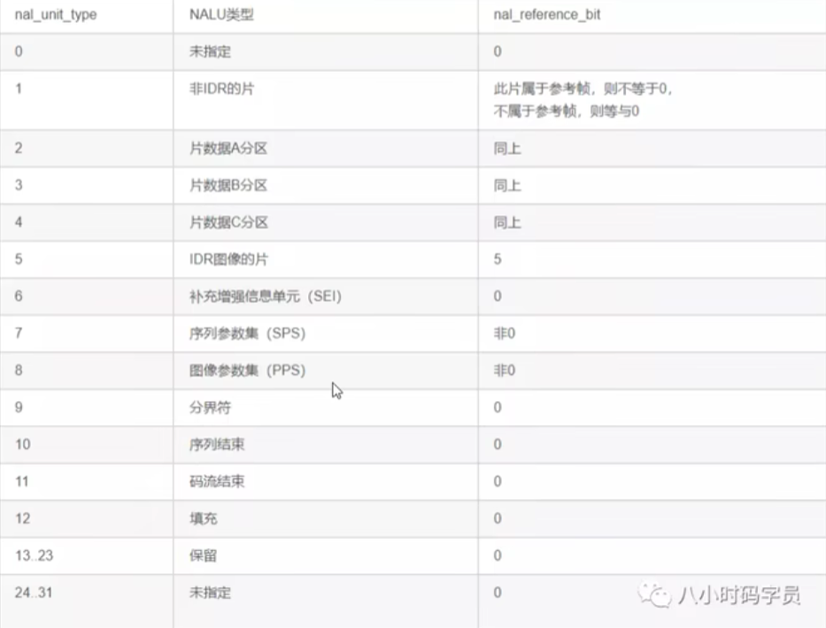
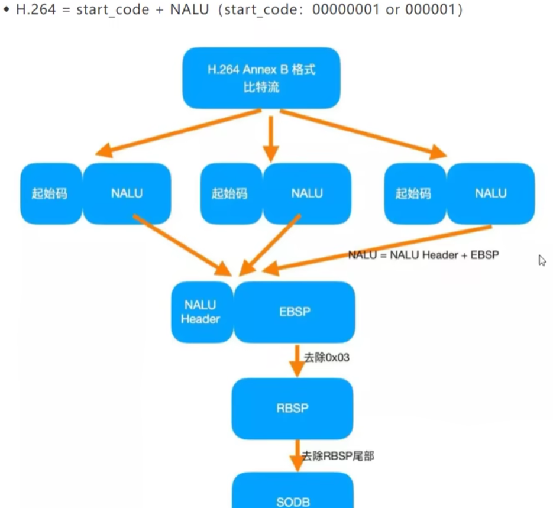
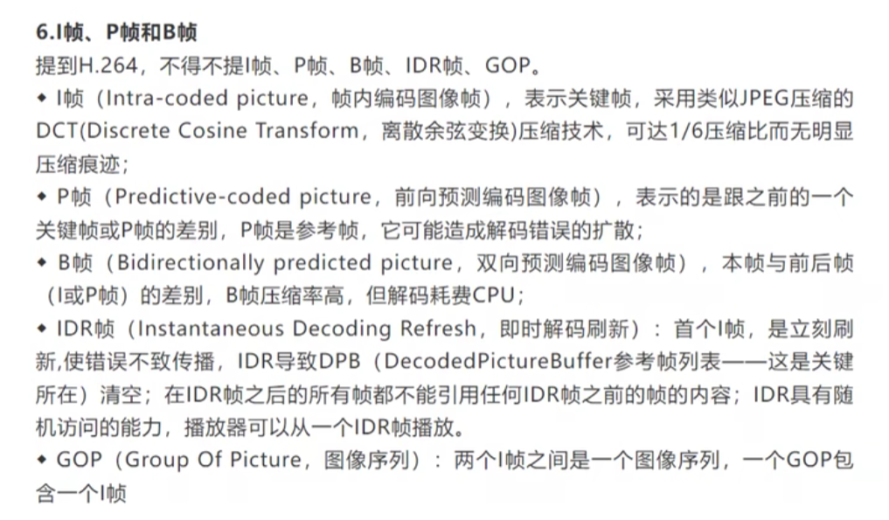
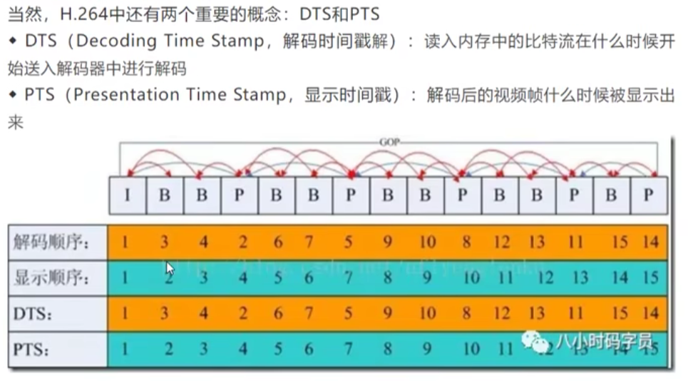

# 一、音视频播放的流程

流程如下:

# 二、录播、点播、直播

## 1.录播

主要集成了音视频的采集、后期剪辑、工具软件的系统。通俗意义上就是生产音视频。

## 2.点播

提前录制好的，可以随意拖动视频进度，通俗来讲就是播放录制好的视频，点播是消费视频。

## 3.直播

特点：实时 同时生产同时消费

# 三、YUV（图像原始数据）

## 1.YUV的文件格式

YUV有两种分类方式，分为“空间-间”和“空间-内”。“空间-间”的划分方式主要体现在Y、U、V的比例不同。而“空间-内”的划分方式是Y、U、V的空间比例固定，而存储格式不同。

## 2.空间-间的数据划分

分为YUV444、YUV422、YUV420

YUV422为何是YU、YV组合：因为他们会共享相邻像素点的uv分量只是y独立

YUV420每四个像素点分享一个uv分量

## 3.空间-内的数据划分

YUV按照空间-内的划分方式，分为packet、planar、semi-planar

1. packet（打包格式）：先存储一个yuv再存储下一个yuv
2. planer（平面格式）：先存y再存u然后再存v
3. semi-planar：先存y再存uv

# 四、H.264

H.264是高度压缩数字视频编解码器标准

## 1.H.264的存储格式

H.264由视频编码层（VCL）和网络适配层（NAL）组成。

VCL：H264编码/压缩的核心，主要负责视频数据的压缩和编码，再切分

NALU：NALU HEADER + NALU payload

## 2.VCL是怎么样压缩的

压缩：预测（帧内预测+帧间预测）-> DCT变化和量化 -> 比特流编码

切分：切片、宏块 提高编码效率 提高网络传输灵活性

包装：成为NAL

## 3.NAL头的结构

## 4.H264的码流结构

## 5.I帧、P帧、B帧

## 6.解码时间戳和显示时间戳

# 五、原始音频PCM格式

## 1.什么是PCM

PCM音频数据是未经压缩的音频采样数据裸流，是经过采样、量化、编码转化成的标准数字音频数据。

## 2.如何理解PCM
